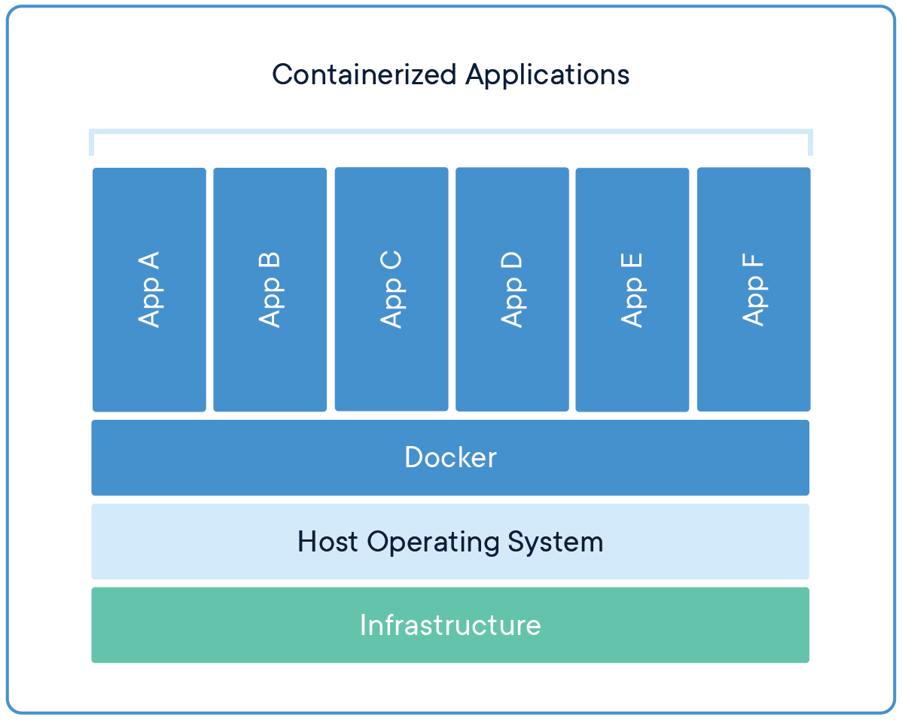

### What is Docker?

Docker is a tool that allows you to run applications in isolated, lightweight containers. This enables running and testing applications in isolated environments, providing better control over dependencies and configuration, as well as facilitating application deployment and scalability. Docker allows for easy building, distribution, and running of applications in different environments without the need for installing additional dependencies and tools.

### How does it work?

Docker operates at the operating system level virtualization, meaning it utilizes the functionality of the operating system kernel to enable running applications in isolated, lightweight containers. Unlike traditional virtualization methods like VirtualBox, where the operating system runs as a guest on a virtual machine, Docker allows for creating containers in which applications are run. Each container contains all the application dependencies and required libraries, enabling the application to run in isolation from other processes on the system. This provides enhanced security and reliability for application execution.

Example of a containerized application infrastructure:



Example of an application infrastructure on virtual machines:


Source: https://www.docker.com/resources/what-container/

#### Here are a few examples of how Docker can be used in specific use cases or applications:

1. Web applications - Isolating applications in containers allows for easy scalability, testing, and deployment of web applications across different environments.
2. Internet applications - Isolating different internet applications in containers simplifies testing and deployment on various environments while preventing dependency conflicts between applications.
3. Microservices applications - Containerization enables easy scaling, testing, and deployment of individual components of a microservices application while ensuring isolation between them.
4. Mobile applications - Isolating mobile applications in containers simplifies testing and deployment on different mobile devices and operating system versions.

### Installation:

It is not recommended to install Docker from package managers (e.g., apt). The packages may not be up to date and often lag behind. Instead, it is recommended to use a script that automatically installs the latest version (for Ubuntu):

```bash
curl -fsSL https://get.docker.com -o get-docker.sh
sudo sh get-docker.sh
```

Source: https://docs.docker.com/engine/install/ubuntu/

For a quick introduction to the basics, I recommend watching a video course in Polish:
https://www.youtube.com/watch?v=wFcAa28kjVQ&list=PLkcy-k498-V5AmftzfqinpMF2LFqSHK5n

When starting your journey with Docker, it's helpful to use a cheatsheet. It speeds up work and organizes knowledge:
https://docs.docker.com/get-started/docker_cheatsheet.pdf

I always recommend exploring the documentation itself for a deeper understanding of the topic:
https://docs.docker.com/